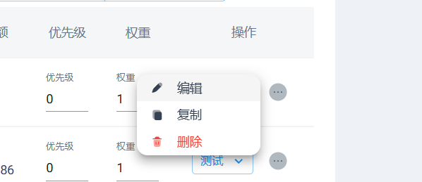
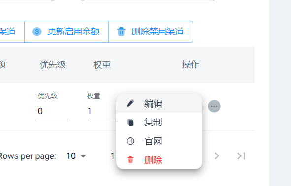

# One-Hub 自定义前端

## 特点

**删除渠道-操作下的官网按钮**

## GitHub Actions Checkout 顺序说明

### 正确顺序

1. **先检出到根目录** (`path: ""`)
2. **再检出到子目录** (`path: "source-repo"`)

### 错误顺序

1. **先检出到子目录**
2. **再检出到根目录**
    - ❌ 第二步会清空工作区，导致第一步的内容丢失

### 核心要点

- `path: ""` 会清空整个工作目录
- `path: "子目录"` 不会清空工作目录
